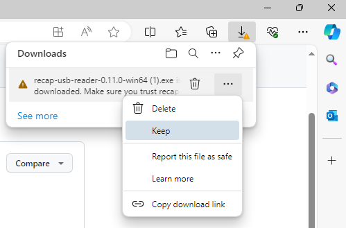
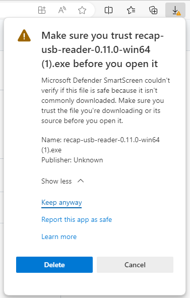
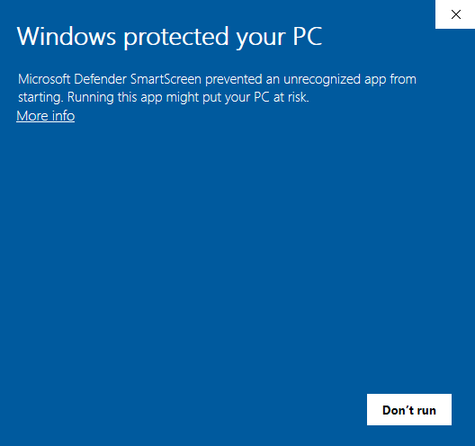

# RECAP USB Reader

[Download latest release](https://github.com/harrymander/recapctl-releases/releases/latest)

## Windows download instructions

Download the latest Windows release from the link above and click on it to open
the installer. Follow the instructions in the installer to install the app
and add shortcuts to your Start Menu and desktop.

You may find that your browser blocks the download. To allow the download,
follow these instructions. (These instructions are for Edge, but the process in
other browsers should be similar.)

1. In the download popup, click on the three dots next to the file and click
   'Keep':

   

2. Another message may appear telling you to make sure you trust the file. Click
   'Show more' and 'Keep anyway'.

   

3. Click on the file to open. Another window may appear as shown below: click
   'More info' and then 'Run anyway'.

   
